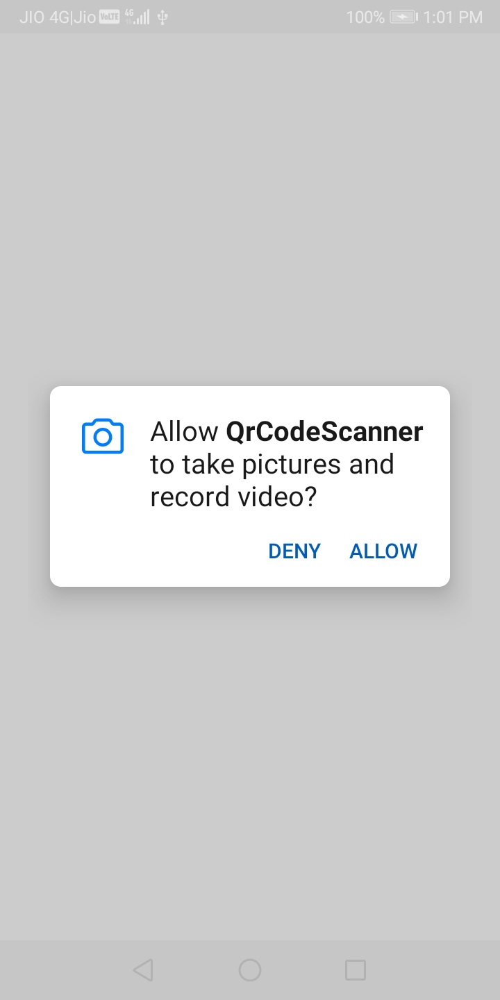
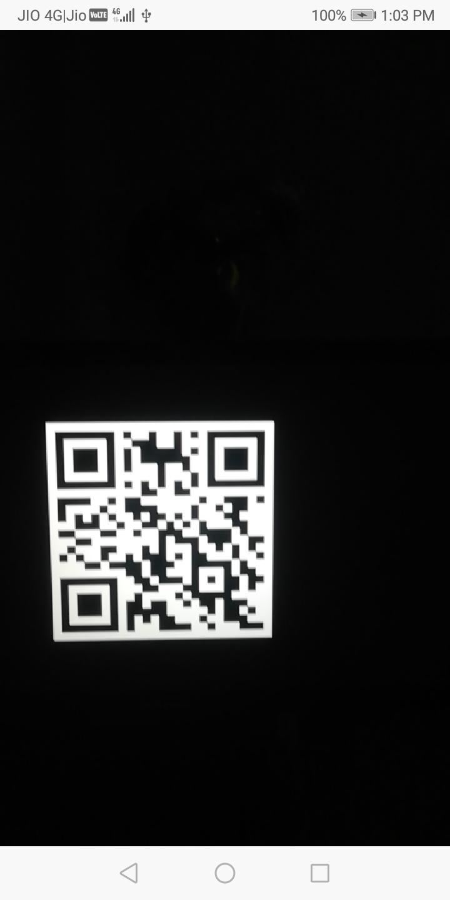

# QR CODE SCANNER

### Description
This QR Code Scanner is a simple yet efficient tool for scanning QR codes using your device's camera. Built with the CameraX API for seamless camera integration and Google's ZXing library for QR code decoding, this application offers a fast and reliable scanning experience. The user interface is crafted with Jetpack Compose, providing a modern and intuitive UI design.

### Features
+ Scan QR codes quickly and accurately.
+ Utilizes CameraX API for smooth camera functionality.
+ Powered by Google's ZXing library for efficient QR code decoding.
+ User-friendly interface created with Jetpack Compose.

### Screenshot

